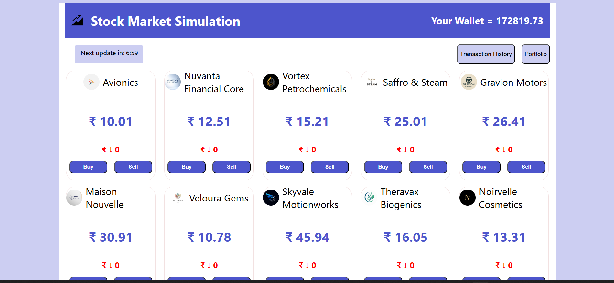

# Stock Exchange Simulation App

A dynamic stock market simulation web application built using React, allowing users to buy and sell shares, track their portfolio, and view transaction history in a real-time interactive environment.

---

## Live Demo
https://stock-exchange-app-zeta.vercel.app/

## Repository Link 
https://github.com/Shankarc98/stock-exchange-app
---

## Tech Stack
- React (Frontend)
- JavaScript (ES6+)
- CSS (Responsive UI)
- React Hooks (useState, useEffect)
- React Router (for navigation)

---

## Features

- Real-time stock price simulation
- Buy and sell shares
- Portfolio tracking
- Transaction history with delete functionality
- Dynamic UI updates using React state
- Responsive design (desktop + mobile)

---

## How It Works

- Stock prices fluctuate dynamically using logic-based simulation
- Users can execute trades based on available balance
- Portfolio updates instantly based on transactions
- Transaction history records all trades with details
- State is managed using React hooks for efficient rendering

---

## Project Structure
```
stock-simulation/
├── public/
│   └── images/
│       ├── stock.svg
│       ├── wallet.svg
│       └── (company logos...)
├── src/
│   ├── Components/
│   │   ├── Buy.jsx
│   │   ├── Card.jsx
│   │   ├── History.jsx
│   │   ├── Home.jsx
│   │   ├── Portfolio.jsx
│   │   ├── Sell.jsx
│   │   ├── Timer.jsx
│   │   └── Transaction.jsx
│   ├── assets/
│   │   └── Data.jsx
│   ├── App.css
│   ├── App.jsx
│   ├── index.css
│   └── main.jsx
├── index.html
├── package.json
└── vite.config.js
```

## Key Learnings

- Improved understanding of React state management using hooks
- Learned component-based architecture and reusability
- Handled dynamic UI updates based on user interactions
- Gained experience building a real-world interactive application

## Challenges Faced

- Managing state across multiple components
- Handling real-time stock price updates efficiently
- Ensuring smooth UI updates without performance issues
- Making the layout responsive for smaller screens

## screenshots


Author: Shankar Narayan 